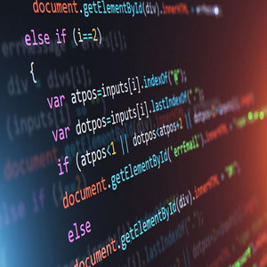

So the first time that I ever started to code was during my junior year in college. At first I have never thought to even major in Computer
Science when I enrolled in college but then at the same time I had on idea what to major in. I knew that I had an interest in Computer in
general since I like to play games on it and usually spend most of my time in front of the computer. Once I took an ICS class, it peaked 
my interest and once I started to code I enjoyed doing so.

As I got into upper ICS class and ended up in software engineering, I felt nervous since I'm going to learn new things that I haven't 
experienced yet. But I was also exicited as well. At first I wasn't as interested in software engineering since I only joined because it 
was a requirement but then I came across a TV show on Netflix called ["Person of Interest"](https://www.imdb.com/title/tt1839578/). I was
intrigued that the person created a system where it would spy on everyone collecting information to prevent terrorism and he was a software
developer.

That show gave me a slight interest of software engineering but in prefer to major in Cyber Security. Maybe I'll take ICS 414 just to 
broaden my knowledge in software engineering and who knows maybe I'll have a change of mind and switch over. So, I'm exicited about ICS
314 and ready to face the challenges that my professor will give.
