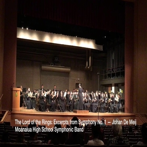

So during all fours years of my high school bands I was enrolled in band class. During the freshman year it was concert band then later in my sophomore, junior, and senior year it was symphonic band. This was of course a music class but here I also got to learn the leadership skills and I have been taught to respect other people. 

My band teacher was very strict on respect as well on responsibility where she would never accept late works so we would always have to turn in assignments or paperwork on time. She would tells us to show respect towards others especially when they show respect towards us. So from this I became more responsible where I would turn in my assignments and paperwork on time and to respect others.

I also got to meet various of different people since my band class accepts people from different grade ranging from sphomores to seniors. We bonded over music and other interests and got along quite well. I gained some leadership skills during my senior year since I was the section leader of my section. I would try to help my section improve their muscial skills and try to arrange the time and place so that we could practice. 
